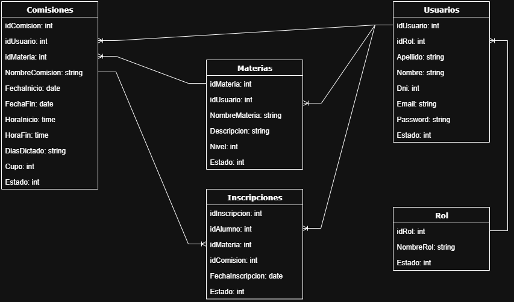

# Aula Link - Next JS - RollingCode School

## Arquitectura del Software:

- Frontend: Next Js.
- Backend: Node Js.
- Base de Datos: Mongo DB

## Funcionalidades:

1- Login y Registro.

2- Página Home donde se mostrarán el listado de cursos que verá el cliente o alumno en este caso para inscripciones a la materia.

3 - Panel de administración donde se maneje Roles, Usuarios, Materias, Comisiones e Inscripciones.

4- Barra de menú horizontal donde aparezcan los links tanto públicos como privados.

5- Inscripciones a la materia que va a cursar el alumno. donde cada materia tiene un profesor, dias de dictado y hora.


## Alcance del proyecto 💡

Este repositorio contiene el **frontend** del sistema **Aulalink**, desarrollado con **Next.js** y estilizado con **Tailwind CSS**.  
Se conecta al backend vía API REST y maneja autenticación con **NextAuth**.

## Link Versión de producción 

- [Vercel](link)

## Tecnologias / Herramientas 🛠

- Next.js 15 (App Router)
- React 19
- Typescript
- Tailwind CSS
- Axios
- NextAuth.js para autenticación
- Zod + React Hook Form para validaciones de formularios
- SweetAlert2 para mensajes y notificaciones
- Zustand para los estados globales

## Para entorno **local**:

Creamos el archivo .env y agregamos las siguientes variables de entorno

- NEXT_PUBLIC_API_URL=http://localhost:4010/api
- NEXTAUTH_SECRET="EsUnaP4labr4S3cr3t4"

## Para entorno **remoto**:

Creamos el archivo .env y agregamos las siguientes variables de entorno

- NEXT_PUBLIC_API_URL=https://backend-aulalink-next.vercel.app/api
- NEXTAUTH_SECRET="EsUnaP4labr4S3cr3t4"

## Pasos para clonar y ejecutar la Aplicación 🖥

Sigue estos pasos para clonar y ejecutar la aplicación en tu entorno local:

1.  **Clona el repositorio:** En tu línea de comandos, ejecuta el siguiente comando para clonar el repositorio:

    ```
    git clone https://github.com/pablogonza37/next-proyecto-final.git
    ```

2.  **Accede al directorio:** Ve al directorio de la aplicación clonada:

    ```
    cd next-proyecto-final
    ```

3.  **Instala las dependencias:** Ejecuta el siguiente comando para instalar las dependencias de la aplicación:

    ```
    npm install
    ```

4.  **Inicia la aplicación:** Utiliza el siguiente comando para iniciar la aplicación en tu entorno local:

    ```
    npm run dev
    ```

5.  **Accede a la aplicación:** Abre tu navegador web y visita la siguiente URL: http://localhost:3000/. La aplicación debería cargarse y estar lista para usar.

## Credenciales para la autenticación

Usuario admin: **admin@admin.com** - Password: **12345678Aa**

Usuario profesor: **profesor@profesor.com** - Password: **12345678Aa**

Usuario alumno: **alumno@alumno.com** - Password: **12345678Aa**

## Repositorio Backend 📌

[Backend AulaLink](https://github.com/jgromerou/backend-aulalink-next.git)

## Diagrama de Clases



## Integrantes

- *Perez, Francisco Miguel*
- *Gonzalez, Pablo Gaston*
- *Capdevilla, Lucas*
- *Romero Uro, Juan Gerardo*
